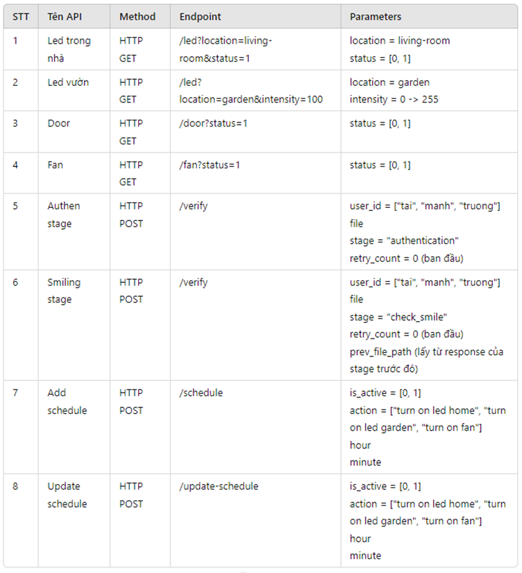
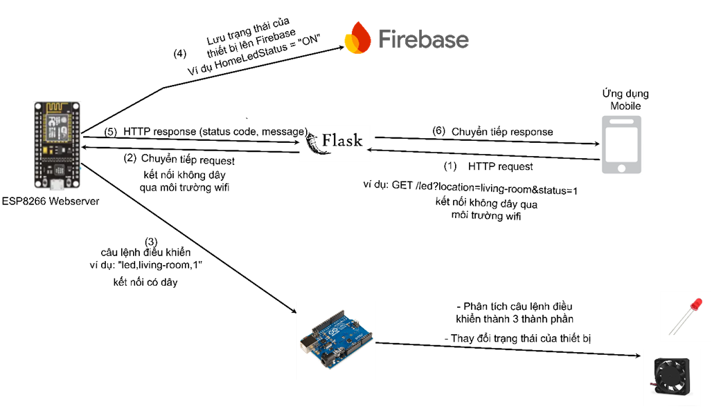
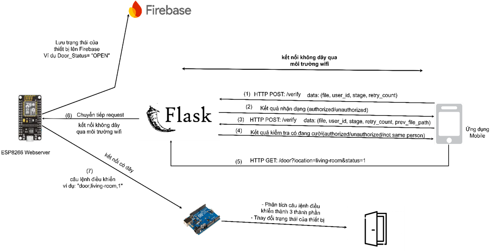
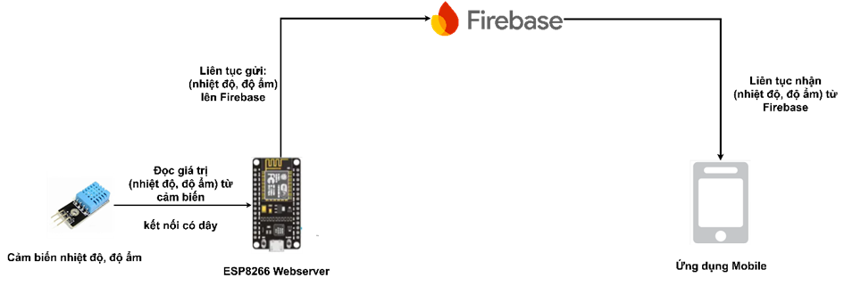

## Smart Home

### Deep Face

    

- This is a lightweight face recognition and facial attribute analysis.
- It is a hybrid face recognition framework wrapping state-of-the-art models: VGG-Face, Google FaceNet, OpenFace, Facebook DeepFace, DeepID, ArcFace and Dlib.
- In this project, I used verify, find and analyze functions of DeepFace for face recognition and facial attribute analysis.

### Flask API
- Provide apis for face recognition and facial attribute analysis.
- Support apis that are used for smart home: turn/on off lights, open/close doors, etc.
- Here APIS:

### Iot Diagrams (Vietnamese version):
#### a. Common diagram for controlling devices in smart home

#### b. Diagram for controlling open door in smart home using face recognition

#### c. Diagram for saving the value from sensors to database

